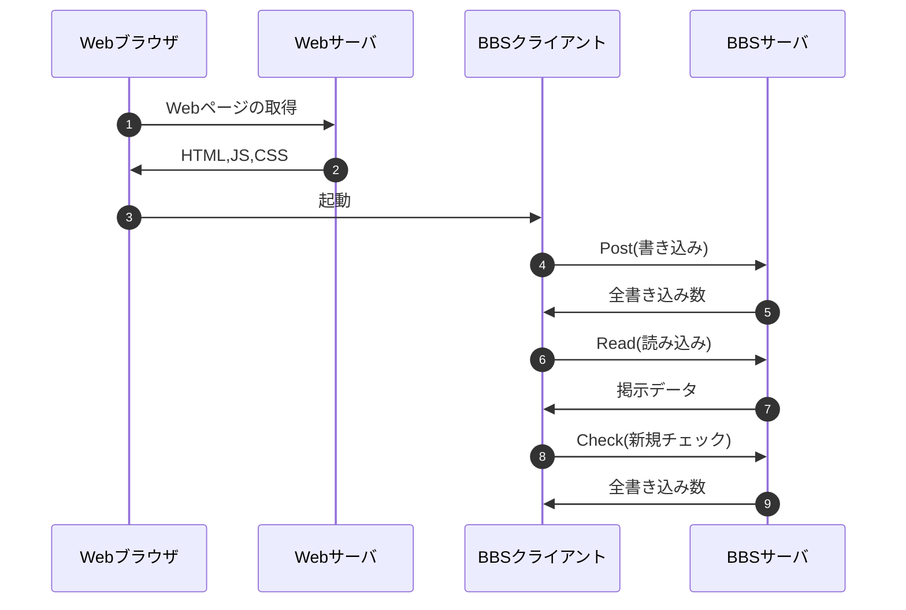
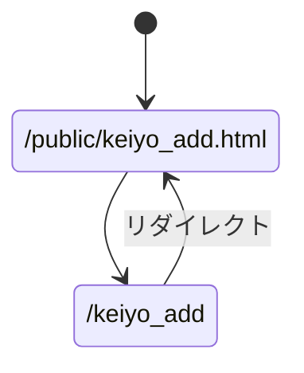
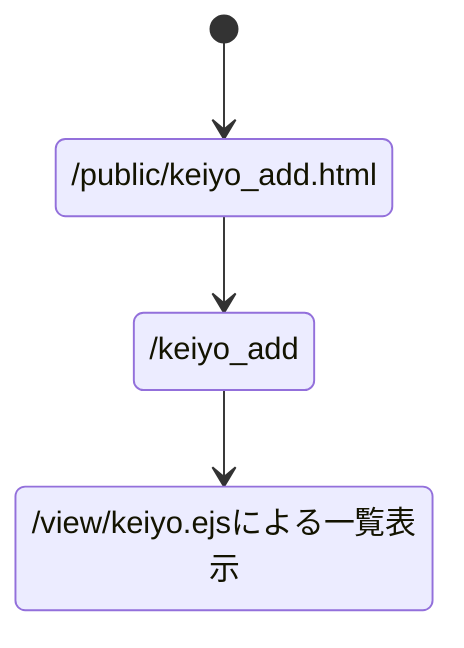

```mermaid
sequenceDiagram
  autonumber
  Webブラウザ ->> Webサーバ: Webページの取得
  Webサーバ ->> Webブラウザ:HTML,JS,CSS
  Webブラウザ ->> BBSクライアント:起動
  BBSクライアント ->> BBSサーバ:Post(書き込み)
  BBSサーバ ->> BBSクライアント:全書き込み数
  BBSクライアント ->> BBSサーバ:Read(読み込み)
  BBSサーバ ->> BBSクライアント:掲示データ
  BBSクライアント ->> BBSサーバ:Check(新規チェック)
  BBSサーバ ->> BBSクライアント:全書き込み数
```

```mermaid
stateDiagram-v2
    [*] --> /public/keiyo_add.html
    /public/keiyo_add.html --> /keiyo_add
    /keiyo_add --> /public/keiyo_add.html:リダイレクト
```

```mermaid
stateDiagram-v2
    [*] --> /public/keiyo_add.html
    /public/keiyo_add.html --> /keiyo_add
    /keiyo_add --> /view/keiyo.ejsによる一覧表示
```

